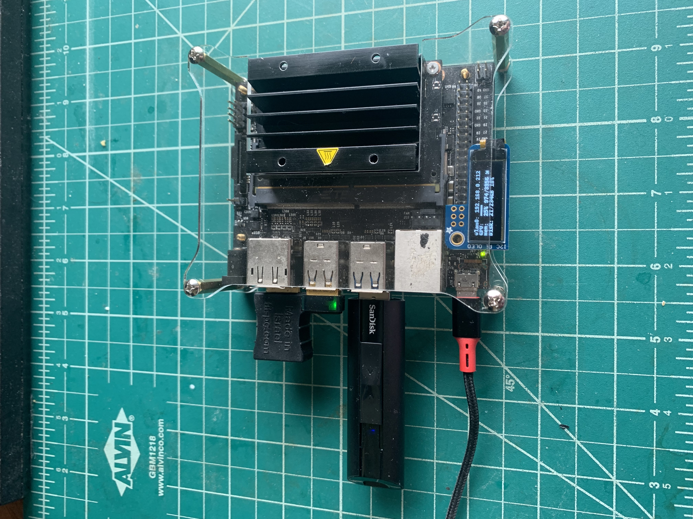
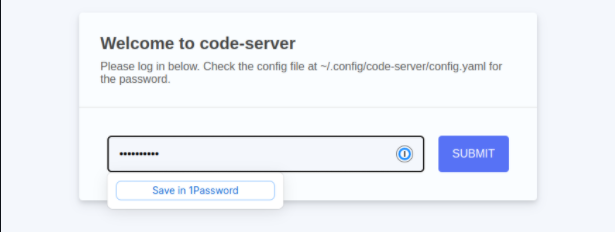
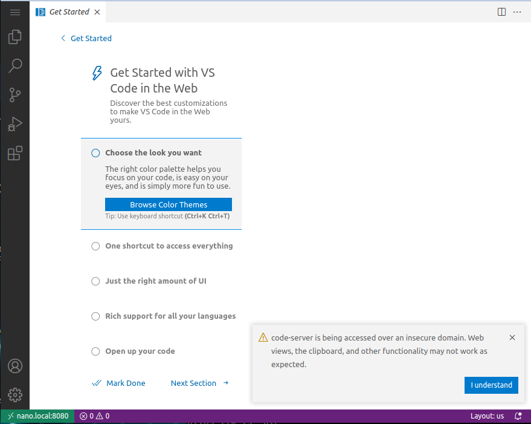
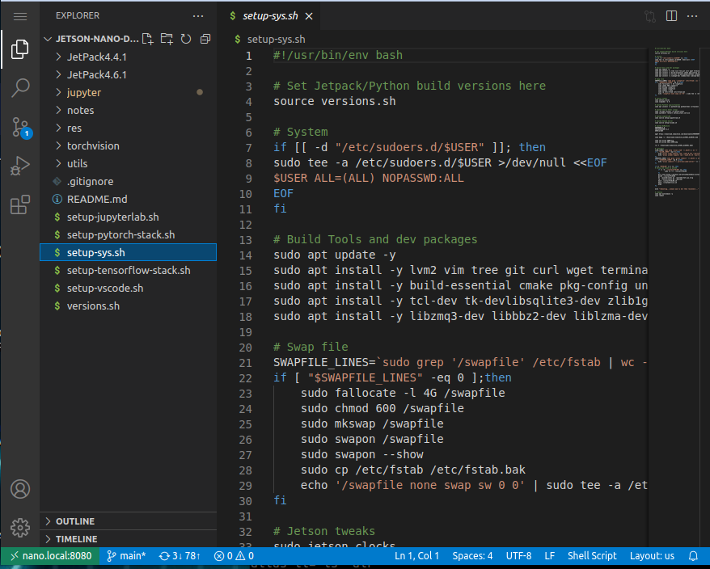
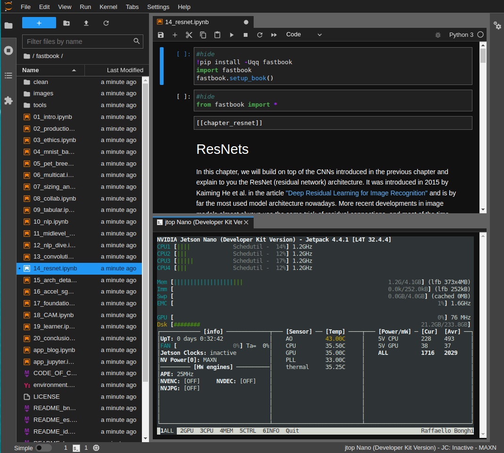
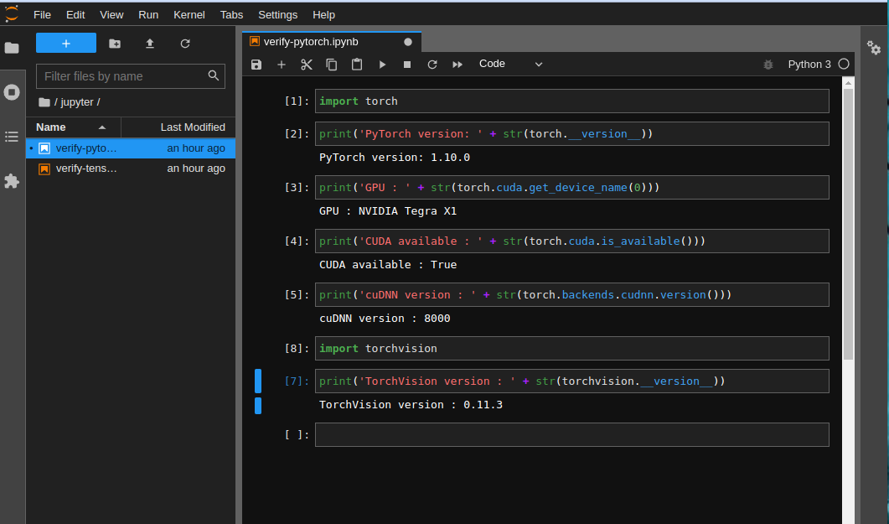
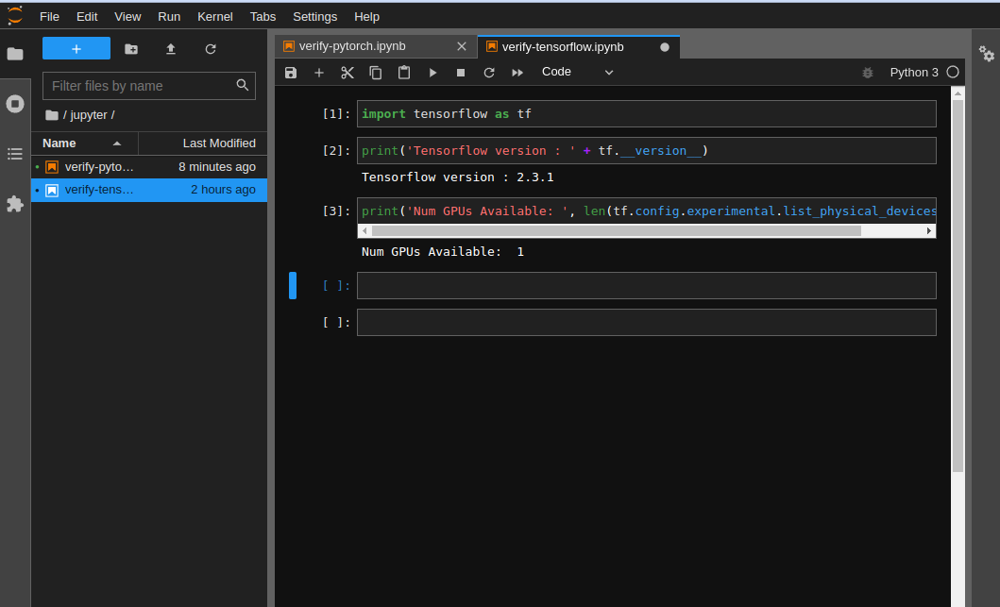
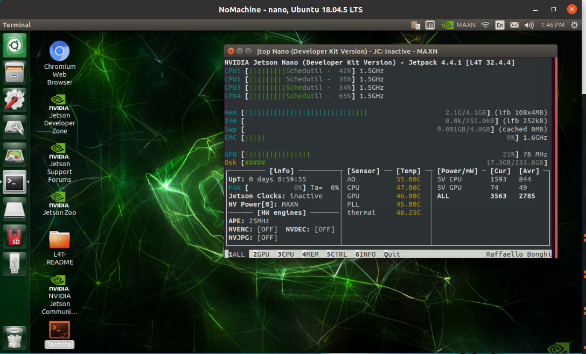

# jetson-nano-dev
This repo is my ongoing collection of notes/scripts describing how I set up my NVidia Jetson Nano for small-scale ML/DL activities. I also like to take it with me when I go camping as it is tiny and low power, so I can run it for days off my solar rig - because we all know what it's like when we get that urge to do ML/DL things whilst out in the wilderness... never get caught short again ! 

## Step 1 - Initial microSD card configuration

The first thing to do is download your Nvidia JetPack image of choice and burn it to your microSD card. I'm currently using v4.4.1, downloaded from here:

[JetPack v4.4.1 Download](https://developer.nvidia.com/jetpack-sdk-441-archive)

After grabbing the zip file, insert your microSD card into your machine and use `sudo lsblk` to figure out it's device name - in my case that was `/dev/sdb`. Then burn the image:

    /usr/bin/unzip -p ~/Downloads/jetson-nano-jp441-sd-card-image.zip | sudo /bin/dd of=/dev/sdb bs=1M status=progress

Once complete, insert the microSD card into the Nano and fire it up. If all is well, you will reach the usual Ubuntu setup flow, so go through that and verify you can log into the desktop etc.

[Boot from USB](https://www.youtube.com/watch?v=J9EJ52Za7IE) (optional)

As my microSD card was pretty small (and slow) I purchased a [256GB fast USB stick](https://www.amazon.com/gp/product/B08GY3Z4JR/ref=ppx_yo_dt_b_asin_title_o06_s00?ie=UTF8&psc=1) and followed the steps described in the JetsonHacks link above.
So now the SD card is only used for booting up - the root filesystem and all the apps now live on the fast USB stick.
Noice!

[UPS Module + OLED](https://www.waveshare.com/product/ai/expansions/power-supply/ups-power-module.htm) (optional)

I needed a power adapter and found this UPS kit, which even came with an OLED screen for monitoring whatever you want. As primarily I will use the Nano in headless mode, I will need to know it's IP address for SSH etc. You can display anything you want on the OLED, so far I've got IP, GPU, MEM, CPU, Batt%.

[PWM Fan](https://www.jetsonhacks.com/2019/09/08/jetson-nano-add-a-fan/)(optional)
I splurged on the recommended fan, supporting PWM.

[Camera](https://www.amazon.com/gp/product/B07RWCGX5K/ref=ppx_yo_dt_b_asin_title_o00_s00?ie=UTF8&psc=1)(optional)
I got a simple camera for image recognition projects.

[Wifi/Bluetooth](https://www.youtube.com/watch?v=v_neNpfQ38Q)

I use a cheap USB wifi adapter but you can also free up a USB port and install a wifi/bluetooth card as described in the link above.

So with all that set up, from a terminal on your iPad/Laptop, SSH into your Nano and continue the steps described below.
## Step2 - Setup System 
    cd ~
    sudo apt install -y git
    git clone https://github.com/miramar-labs/jetson-nano-dev.git
    cd ~/jetson-nano-dev
    bash ./setup-sys.sh

## Step 3 - Setup Tensorflow (optional)

    bash ./setup-tensorflow-stack.sh

## Step 4 - Setup PyTorch (optional)

    bash ./setup-pytorch-stack.sh

## Development Environments

As mentioned before, I SSH into the Nano, and from there I mainly use two development environments, depending on what I'm doing:

### [VSCode Server](https://code.visualstudio.com/)

From your SSH terminal, start the VSCode server:

    codesvr

Then you should be able to access VSCode from your laptop/iPad browser, eg:

    http://nano.local:8080

Log in with the password that was set in the `setup-vscode.sh` script, configure...:

And you're off to the races:

### [JupyterLab](https://jupyterlab.readthedocs.io/en/stable/getting_started/installation.html)

Where I do most of my ML/DL stuff in PyTorch or Tensorflow.

- from your SSH terminal, activate the Python virtual environment you want to work in, eg PyTorch:

        py3.6.9_PyTorch_jp4.4.1

- start JupyterLAB server:

        jlab

    You will then see instructions as to how to connect to it via your iPad/Laptop browser:

        aaron@nano:~/jetson-nano-dev$ py3.6.9_PyTorch_jp4.4.1 
        (py3.6.9_PyTorch_jp4.4.1) aaron@nano:~/jetson-nano-dev$ jlab
        [I 2022-03-17 10:58:42.609 ServerApp] jupyterlab | extension was successfully linked.
        [I 2022-03-17 10:58:43.821 ServerApp] nbclassic | extension was successfully linked.
        [I 2022-03-17 10:58:43.942 ServerApp] nbclassic | extension was successfully loaded.
        [I 2022-03-17 10:58:43.946 LabApp] JupyterLab extension loaded from /home/aaron/venv/py3.6.9_PyTorch_jp4.4.1/lib/python3.6/site-packages/jupyterlab
        [I 2022-03-17 10:58:43.946 LabApp] JupyterLab application directory is /home/aaron/venv/py3.6.9_PyTorch_jp4.4.1/share/jupyter/lab
        [I 2022-03-17 10:58:43.962 ServerApp] jupyterlab | extension was successfully loaded.
        [I 2022-03-17 10:58:43.963 ServerApp] The port 8080 is already in use, trying another port.
        [I 2022-03-17 10:58:43.964 ServerApp] Serving notebooks from local directory: /home/aaron/jetson-nano-dev
        [I 2022-03-17 10:58:43.964 ServerApp] Jupyter Server 1.13.1 is running at:
        [I 2022-03-17 10:58:43.964 ServerApp] http://nano:8081/lab?token=96ee4d4862163db7238590e0dc867a686aeaa447ad943afa
        [I 2022-03-17 10:58:43.964 ServerApp]  or http://127.0.0.1:8081/lab?token=96ee4d4862163db7238590e0dc867a686aeaa447ad943afa
        [I 2022-03-17 10:58:43.965 ServerApp] Use Control-C to stop this server and shut down all kernels (twice to skip confirmation).
        [W 2022-03-17 10:58:43.983 ServerApp] No web browser found: could not locate runnable browser.
        [C 2022-03-17 10:58:43.984 ServerApp] 
    
        To access the server, open this file in a browser:
            file:///home/aaron/.local/share/jupyter/runtime/jpserver-24421-open.html
        Or copy and paste one of these URLs:
            http://nano:8081/lab?token=96ee4d4862163db7238590e0dc867a686aeaa447ad943afa
        or http://127.0.0.1:8081/lab?token=96ee4d4862163db7238590e0dc867a686aeaa447ad943afa

    You might need to modify that URL to point it to your Nano by it's IP address (displayed on the PiOLED, same IP address you use for SSH) eg:

        http://192.168.0.212:8081/lab?token=96ee4d4862163db7238590e0dc867a686aeaa447ad943afa

    OR this may also work, if your Nano hostname is `nano`:

        http://nano.local:8081/lab?token=96ee4d4862163db7238590e0dc867a686aeaa447ad943afa

If all is well you should see something like this:

### Verify PyTorch is set up correctly to see the GPU

Run jupyter/verify-pytorch.ipynb:

    aaron@nano:~$ py3.6.9_PyTorch_jp4.4.1 
    (py3.6.9_PyTorch_jp4.4.1) aaron@nano:~$ jlab

If all is well you should see:

### Verify Tensorflow is set up correctly to see the GPU

Run jupyter/verify-tensorflow.ipynb:

    aaron@nano:~$ py3.6.9_Tensorflow_jp4.4.1 
    (py3.6.9_Tensorflow_jp4.4.1) aaron@nano:~$ jlab

If all is well you should see:

### Access Desktop 

Install the [NoMachine client](https://www.nomachine.com/) on your Laptop/iPad in order to access the desktop:

NOTE: You may have to use an [HDMI dongle](https://www.amazon.com/1920x1080-generation-Headless-Emulator-Ethereum/dp/B07D9JLPY9/ref=sr_1_17_sspa?crid=1B9D9RXUHID27&keywords=hdmi+dongle&qid=1647728132&sprefix=hdmi+dongle%2Caps%2C134&sr=8-17-spons&psc=1&spLa=ZW5jcnlwdGVkUXVhbGlmaWVyPUEyTFVJMEhZQlpFMDA2JmVuY3J5cHRlZElkPUEwNDU5NDI4TEZQSUdCMDZSSzdOJmVuY3J5cHRlZEFkSWQ9QTAxNzMzOTcyQUJIS1Q2RzI1NDBXJndpZGdldE5hbWU9c3BfbXRmJmFjdGlvbj1jbGlja1JlZGlyZWN0JmRvTm90TG9nQ2xpY2s9dHJ1ZQ==) to get this to work
## Essential Links

[NVidia Jetson Nano forum](https://forums.developer.nvidia.com/c/agx-autonomous-machines/jetson-embedded-systems/jetson-nano/76)

[JetsonHacks YouTube channel](https://www.youtube.com/channel/UCQs0lwV6E4p7LQaGJ6fgy5Q)

[NVidia Developer](https://developer.nvidia.com/)