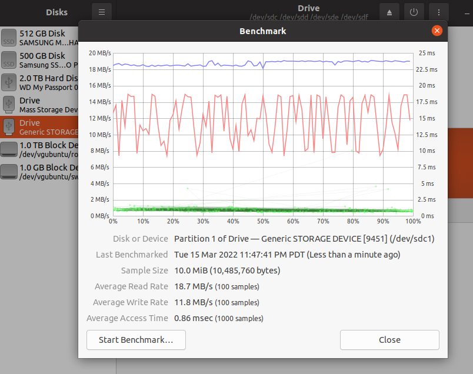

# MicroSD card Performance Notes

## Use disks utility to benchmark the SSD

## Use gparted for partitioning/resizing/formatting
    
## monitor dirty bytes left in system virt mem cache:

    watch -n 1 'sudo cat /proc/meminfo | grep Dirty'

while doing sd card writes, this will give you an idea how much writing is left to go ... for example, when flashing the jetson image to microSD card:

    /usr/bin/unzip -p ~/Downloads/jetson-nano-jp441-sd-card-image.zip | sudo /bin/dd of=/dev/sdb bs=1M status=progress

the progress indicator will start off showing fast speeds but gradually slow down ... why? initially the indicator is showing read speeds but as the VMem cache fills up, the write operation becomes the dominant thing, and SD writes are usually slower than reads...